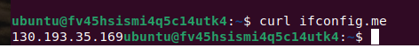
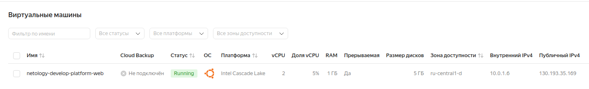

### Задание 1
- скриншот ЛК Yandex Cloud с созданной ВМ, где видно внешний ip-адрес;  
  
- скриншот консоли, curl должен отобразить тот же внешний ip-адрес;  
  
- ответы на вопросы
  - Нужно было скопировать публичный ключ, а не закрытый в переменную **vms_ssh_root_key**
  - platform_id = "**standart-v4**" не существует, было выбрано значение   platform_id = "**standard-v2**"
  - количество ядер для данной платформы исправлено 1 на 2
  - **preemptible = true** и **core_fraction=5** в параметрах ВМ используются для создания прерываемого инстанса с минимально возможной долей использования CPU для оптимизации затрат
