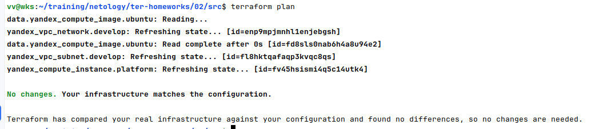
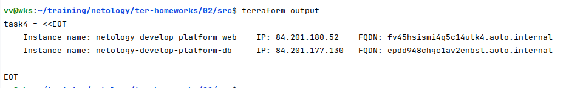
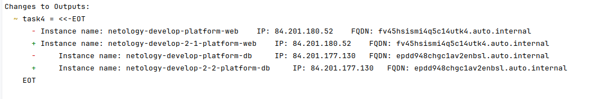

### Задание 1
- скриншот ЛК Yandex Cloud с созданной ВМ, где видно внешний ip-адрес;  
  
- скриншот консоли, curl должен отобразить тот же внешний ip-адрес;  
  
- ответы на вопросы
  - Нужно было скопировать публичный ключ, а не закрытый в переменную **vms_ssh_root_key**
  - platform_id = "**standart-v4**" не существует, было выбрано значение   platform_id = "**standard-v2**"
  - количество ядер для данной платформы исправлено 1 на 2
  - **preemptible = true** и **core_fraction=5** в параметрах ВМ используются для создания прерываемого инстанса с минимально возможной долей использования CPU для оптимизации затрат

### Задание 2
Код в репозитории.  
После изменения переменных план не изменился


### Задание 3
```terraform
resource "yandex_compute_instance" "platform-db" {
  name        = var.vm_db_name

  platform_id = var.vm_db_platform
  zone        = var.vm_db_zone

  resources {
         cores         = var.vm_db_cores
         memory        = var.vm_db_memory
         core_fraction = var.vm_db_fraction
  }
  boot_disk {
    initialize_params {
      image_id = data.yandex_compute_image.ubuntu.image_id
    }
  }
  scheduling_policy {
    preemptible = var.vm_db_preemptible
  }
  network_interface {
    subnet_id = yandex_vpc_subnet.develop_db.id
    nat       = var.vm_db_nat
  }

    metadata = {
      serial-port-enable = var.vm_db_serial_port
      ssh-keys           = "ubuntu:${var.vms_ssh_root_key}"
    }
}
```
### Задание 4
```terraform
output "task4" {
  value = <<EOT
    Instance name: ${yandex_compute_instance.platform.name}    IP: ${yandex_compute_instance.platform.network_interface.0.nat_ip_address}    FQDN: ${yandex_compute_instance.platform.fqdn}
    Instance name: ${yandex_compute_instance.platform-db.name}     IP: ${yandex_compute_instance.platform-db.network_interface.0.nat_ip_address}   FQDN: ${yandex_compute_instance.platform-db.fqdn}
  EOT
}
```


### Задание 5
```terraform
locals {
  name-web = "netology-${var.vpc_name}-${var.vm_web_cores}-${var.vm_web_memory}-platform-web"
  name-db = "netology-${var.vpc_name}-${var.vm_db_cores}-${var.vm_db_memory}-platform-db"
}
```


### Задание 6
#### 6.1
Пример использования переменной vms_resources
```terraform
resource "yandex_compute_instance" "platform-db" {
...
  resources {
    cores         = var.vms_resources.db.cores
    memory        = var.vms_resources.db.memory
    core_fraction = var.vms_resources.db.core_fraction
...
  }
```
#### 6.2
Переменная metadata переопределена в personal.auto.tfvars
```terraform
variable   "metadata"  {
  default = {
    serial-port-enable = 1
    ssh-keys           = "ubuntu:<SSH_PUB_KEY>"
  }
}
```
#### 6.3
Код в репозитории
#### 6.4
Изменений нет
