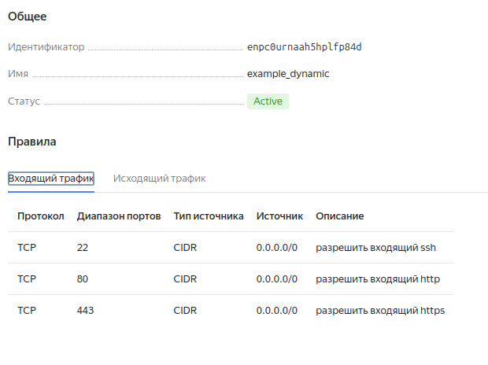
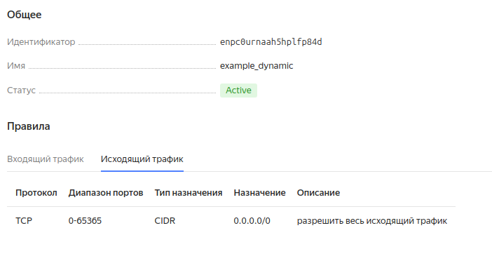
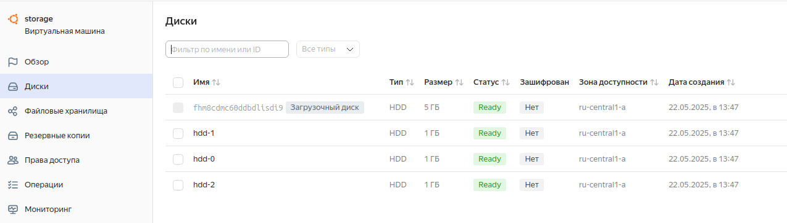
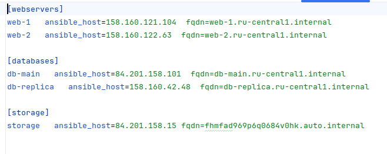

### Задание 1

Приложите скриншот входящих правил «Группы безопасности» в ЛК Yandex Cloud   



### Задание 2
#### 2.1, 2.4
```terraform
resource "yandex_compute_instance" "web" {
  depends_on = [yandex_compute_instance.db]

  count=2
  name        = "web-${count.index+1}"
  hostname    =  "web-${count.index+1}"

  network_interface {
    subnet_id = yandex_vpc_subnet.develop.id
    nat       = var.vm_nat
    security_group_ids = toset([yandex_vpc_security_group.example.id])
  ...
  }
```
#### 2.2
```terraform
variable "each_vm" {
  default = [
    {
      vm_name     = "main"
      cpu         = 2
      ram         = 1
      disk_volume = 6
    },
    {
      vm_name     = "replica"
      cpu         = 2
      ram         = 2
      disk_volume = 8
    }]
}

resource "yandex_compute_instance" "db" {
  for_each = {for vm in var.each_vm : vm.vm_name => vm}

  name     = "db-${each.key}"
  hostname = "db-${each.value.vm_name}"

  platform_id = var.vm_platform

  resources {
    cores         = each.value.cpu
    memory        = each.value.ram
    core_fraction = 5
  }
  boot_disk {
    initialize_params {
      image_id = data.yandex_compute_image.ubuntu.image_id
      type     = "network-hdd"
      size     = each.value.disk_volume
    }
  }
  ...
}
```
#### 2.5
```terraform
variable "ssh_key_path" {
  type=string
  default = "~/.ssh/id_ed25519.pub"
}

locals {
  metadata = {
    serial-port-enable = 1
    ssh-keys = "ubuntu: ${file(var.ssh_key_path)}"
  }
}
```
### Задание 3
#### 3.1
```terraform
resource "yandex_compute_disk" "hdd" {
  count = 3
  name  = "hdd-${count.index}"
  type       = "network-hdd"
  size       = 1
}
```
#### 3.2
```terraform
resource "yandex_compute_instance" "storage" {
  depends_on = [yandex_compute_disk.hdd]
  name        = "storage"

  dynamic "secondary_disk" {
    for_each = yandex_compute_disk.hdd
    content {
      disk_id = secondary_disk.value.id
    }
  ...
```

### Задание 4
#### 4.1 Использование  templatefile
```terraform
resource "local_file" "hosts_templatefile" {
  content = templatefile(
    "${path.module}/hosts.tftpl",
    {
      webservers = yandex_compute_instance.web,
      databases  = yandex_compute_instance.db,
      storage    = [yandex_compute_instance.storage]
    }
  )
  filename = "${abspath(path.module)}/hosts.ini"
}
```
#### 4.2, 4.3 Inventory template
```terraform
[webservers]

%{~ for i in webservers ~}
${i["name"]}   ansible_host=${i["network_interface"][0]["nat_ip_address"]}  fqdn=${i["fqdn"]}

%{~ endfor ~}

[databases]

%{~ for i in databases ~}
${i["name"]}   ansible_host=${i["network_interface"][0]["nat_ip_address"]}  fqdn=${i["fqdn"]}

%{~ endfor ~}

[storage]

%{~ for i in storage ~}
${i["name"]}   ansible_host=${i["network_interface"][0]["nat_ip_address"]} fqdn=${i.fqdn}

%{~ endfor ~}
```
Результат
